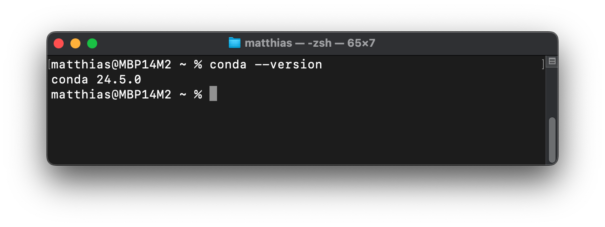
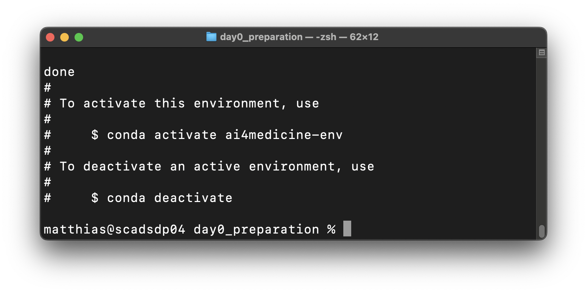
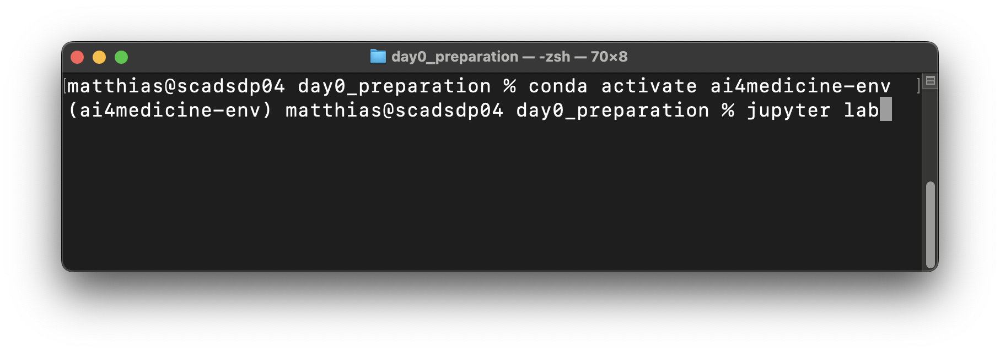
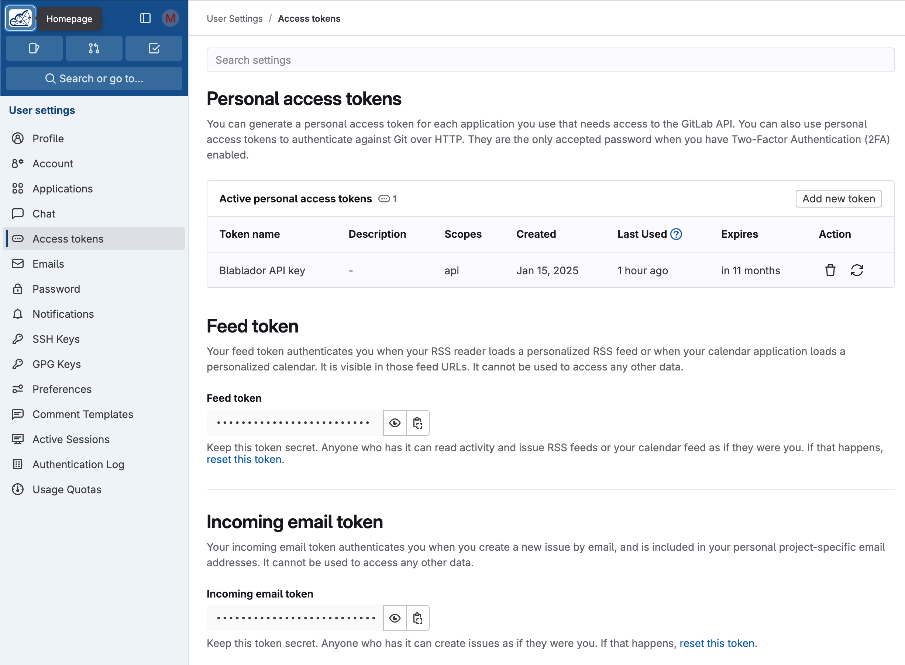

# Prepare Your Computer

While we will also use computing resources of the University Computing Center, some of the practical work will be done locally on your computer. This section provides information on how to prepare your computer for the training school.  
**Please read everything carefully and then follow the individual steps.**

---

## Setting Up Conda for Python

### What is Conda and Miniconda?

**[Conda](https://docs.conda.io/projects/conda/en/latest/user-guide/getting-started.html)** is an open-source management tool for software packages and virtual environments with Python. It allows you to quickly create and manage different isolated virtual environments, each with its own Python version and its own software packages. Conda also helps with the installation, execution, and updating of software packages and their dependencies. Conda is available in various versions for Windows, MacOS, and Linux.

**[Miniconda](https://docs.anaconda.com/miniconda/)** is a lightweight version of Anaconda - a comprehensive, conda-based Python distribution for Data Science. While Anaconda comes with a variety of pre-installed software packages and requires a lot of space, Miniconda only contains conda and the most important core dependencies, so that later on, you can manually install the packages that are actually needed.

### Setting Up Miniconda

If conda or Miniconda is already installed and available on your computer (see "Check Installation"),
you can skip this section. Otherwise, follow these steps to install Miniconda on your computer:

1. **Download Miniconda:**
* Visit the [Miniconda Download Page](https://www.anaconda.com/download/success#miniconda)
* Choose the suitable _Miniconda_ installer for your computer and operating system (Windows, macOS, or Linux) and download it
2. **Install Miniconda:**
* Start the installation program and follow the instructions on the download page and the instructions in the installation dialog. For most users, the default settings are the best choice.
* During installation, you will be prompted to initialize conda and/or add conda to the PATH variable, depending on the operating system. _Accept these options_, even if you are warned that this is not recommended - conda will be added to your system's PATH variable, which makes it easier to use via the terminal and other tools.
3. **Check Installation:**
* Open the terminal or command prompt.
* Enter `conda --version` and press Enter.
* You should see the respective version number of conda (see screenshot below), which means that the installation was successful.
* Execute `conda config --set auto_activate_base false`

For an overview of using conda, it is recommended to take a look at the [CheatSheet](https://docs.conda.io/projects/conda/en/stable/user-guide/cheatsheet.html) provided in the documentation.

### Preparing a Virtual Python Environment

In the context of the training school, [Jupyter Lab](https://jupyterlab.readthedocs.io/en/latest/) and various other software packages will be used. In order to ensure that these are uniformly and completely available for all participants, we provide a configuration file for conda. With this configuration file, you can let conda create a virtual Python environment in which the required software packages are automatically installed.

1. **Download File**
* Save the following file on your computer: [conda-ai4med-env.yml](conda-ai4med-env.yml)
2. **Create Virtual Environment**
* Open a terminal or command prompt
* Navigate to the file's location
* Execute this command: `conda env update -f conda-ai4med-env.yml --prune`
* With this command:
  * Conda creates a new environment with the name "ai4medicine-env" or updates an already existing one with the same name
  * Conda downloads and installs all defined software packages in the environment
* After successful installation, the following success message should appear

3. **Troubleshooting**
* If problems occur, e.g. with an already existing environment "ai4medicine-env", you can remove it completely and start from scratch
* Execute this command: `conda remove --name ai4medicine-env --all`
* Then, perform the above steps for a fresh installation of the environment

4. **Test the Virtual Environment**
* Open a terminal or command prompt
* Execute the following command: `conda activate ai4medicine-env` - the environment is activated
* Start Jupyter Lab for testing: `jupyter lab` - your browser should open with Jupyter Lab
* Then, Jupyter Lab can be shut down or terminated (e.g., Ctrl-C in the terminal)
* To deactivate the environment run: `conda deactivate`

---
  
## Registration at Helmholtz Blablador

In the  training school, we want to take a look at how Large Language Models (LLM) and AI chatbots based on them can support us in coding and data analysis. Helmholtz-Jülich provides a free LLM service for researchers called "[Blablador](https://helmholtz-blablador.fz-juelich.de/)". In order to use this service, prior registration and creation of an API key are necessary.

Please follow the steps on [this website](https://sdlaml.pages.jsc.fz-juelich.de/ai/guides/blablador_api_access/) as described:

1. **Register at Helmholtz Gitlab (Codebase)**
* Open the [Helmholtz Codebase](https://codebase.helmholtz.cloud/users/sign_in)
* Log in via "Helmholtz ID" and select your university to authenticate with your university account
2. **Create an API Key (Token)**
* _ATTENTION: this API key should be treated like a personal password and should not be made available to anyone else!_
* Open your [profile page](https://codebase.helmholtz.cloud/-/profile/preferences)
* Select "Access Token" on the left side
* Under "Personal access tokens", create a new token via "Add new token"
* Name it best "Blablador API key"
* Select "api" as scope
* Copy the displayed key and save it securely (e.g. password manager) - it will not be displayed again after confirmation

A brief explanation of Large Language Models (LLM) and AI assistants can be downloaded as PDF [here](../day1.2_ai_assistant/llm_ai-assistant.pdf).

---
  
## Download the Files for the Practical Exercise

* The notebooks and files for the practical exercise can be downloaded as a ZIP [here](notebooks_download.zip) as soon they are complete.
* Unpack the downloaded ZIP
* Open a terminal or command prompt and navigate to the unpacked folder
* `cd path/to/notebooks_download`
* Activate the prepared conda environment in this folder and start Jupyter Lab like described above in "Preparing a Virtual Python Environment" - "4: Test the Virtual Environment"

---
  

Congratulations - the preparations are complete.

